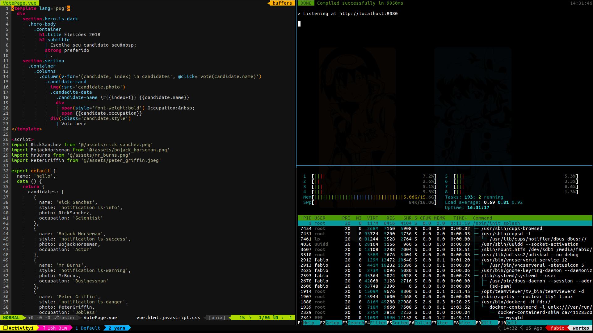

# Dotfiles
A collection de scripts that I use on my daily activities.
  
### Which Includes:
  
  - `Oh-My-Zsh` (with my custom theme called `Ziggoto-theme`)
  - `Vim Bootstrap` customized
	  - Yank and Paste to system's clipboard with xclip
	  - Systastic configured for Ecmascript (and support to .vue files)
	  - Mouse mode always enabled by default
  - My tmux confs and plugins
	  - Based on @gpakosz tmux dotfiles
	  - Vi mode always enabled
	  - Plugins like `tmux-yank` and `tmux-ressurect`

### And this is how it's looks like:
  

