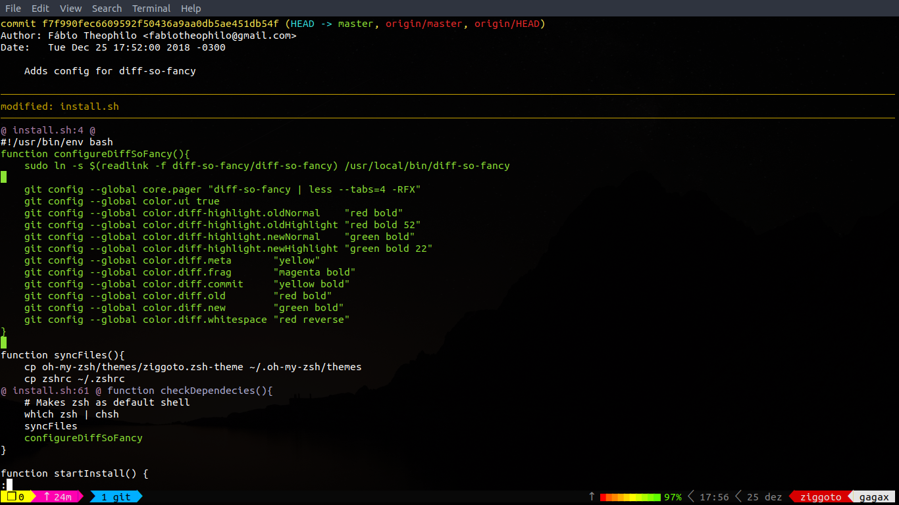
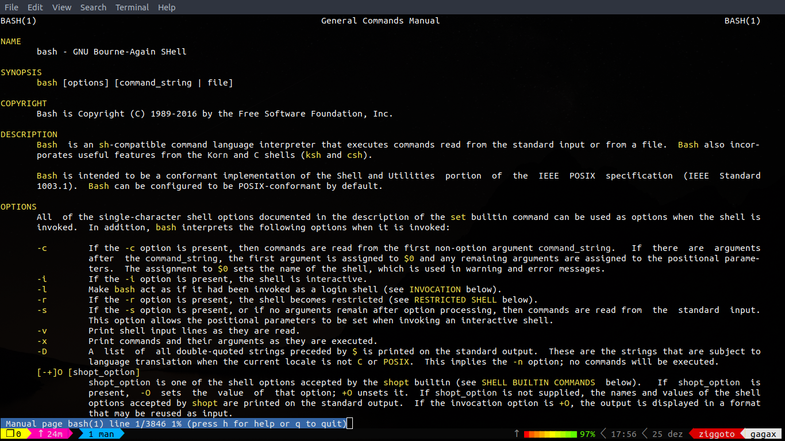

# Dotfiles
A collection de scripts that I use on my daily activities.

### Which Includes:

  - `Oh-My-Zsh` (with my custom theme called `Ziggoto-theme`)
      - (new) Vim mode enabled on ZSH
  - `Vim Bootstrap` customized
	  - Yank and Paste to system's clipboard with xclip
	  - Systastic configured for Ecmascript (and support to .vue files)
	  - Mouse mode always enabled by default
  - My tmux confs and plugins
	  - Based on @gpakosz tmux dotfiles
	  - Vi mode always enabled
	  - Plugins like `tmux-yank` and `tmux-ressurect`
  - `Diff-so-fancy`

### And this is how it's looks like:

### Installation
If you're using a debian like Linux distro (aka Ubuntu, Mint, Deepin, Elementary, Kali and others) you can just run:

`$ sudo ./install.sh`

If you're using Windows or OSX you will have to make this installation manually
